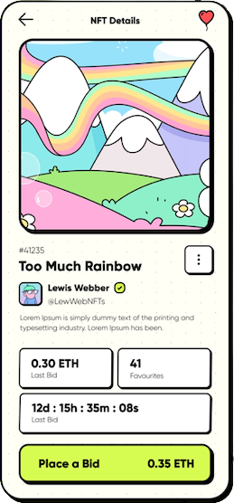
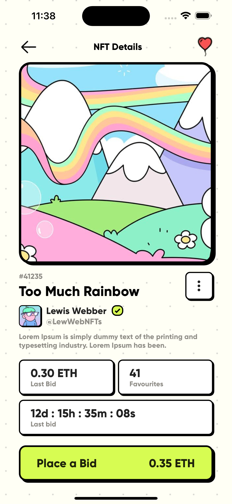
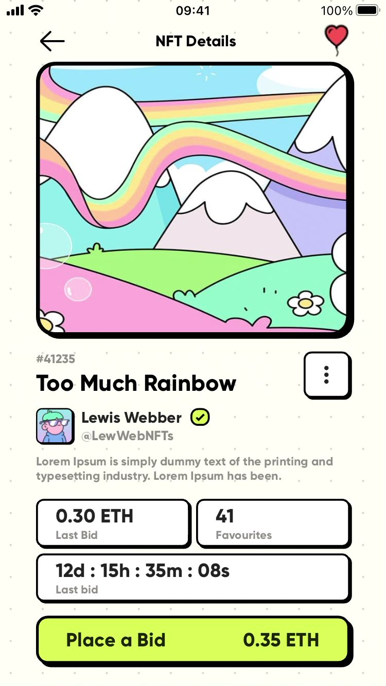
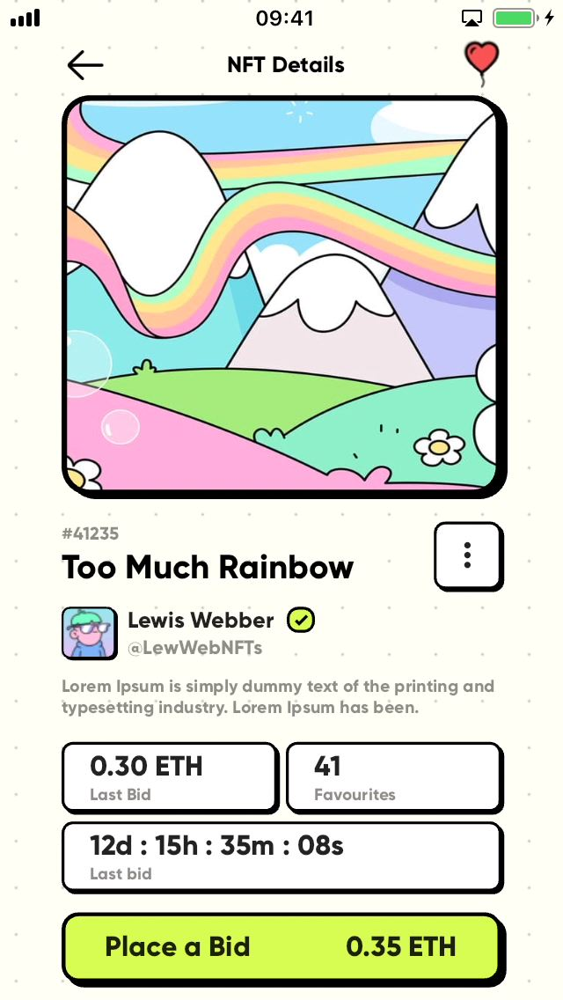
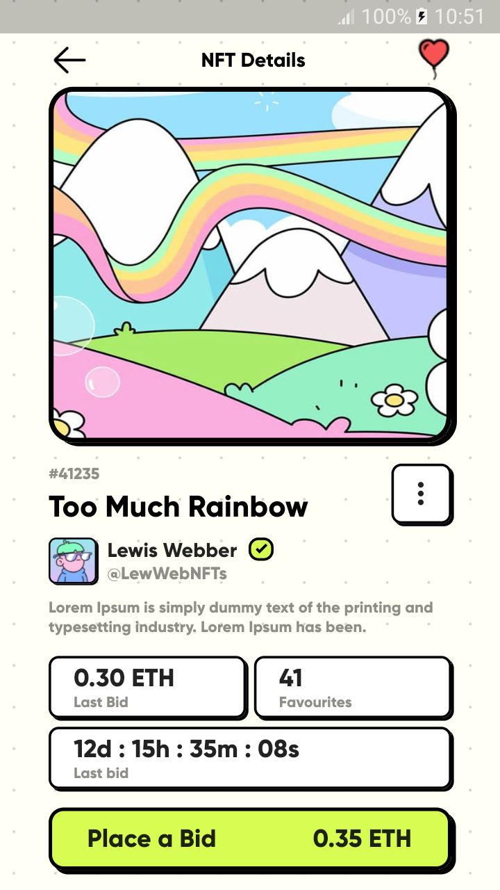

# NFT Marketplace - reprodução de design neubrutalismo em Flutter

O neubrutalismo é um estilo de design cujos elementos possuem aspectos simples, um tanto quanto brutos e ásperos, semelhantes a blocos, com cores e tipografias bem específicas, tendo como base o movimento de arquitetura brutalista de meados do século XX.

É um estilo que requer um certo cuidado ao ser aplicado, pois seu aspecto visualmente duro, denso, pode ser desconfortável dependendo do tipo da aplicação, da quantidade de dados e a disposição deles, além de seu público-alvo.

Aplicações como portfólios de fotografias e artes, POCs (Proof of Concept), principalmente de startups, com o intuito de transmitir uma sensação de inovação, possuem grande aceitação ao estilo do neubrutalismo.

O objetivo desse projeto é reproduzir o layout de um modelo de neubrutalismo usando o Flutter, sem a utilização de nenhuma biblioteca específica para isso.

## Dependências

 - Flutter toolkit 3.10.5 (stable)
 - Dart 3.0.5
 - dart_code_metrics ^5.7.5
 - lint: ^2.1.2

## O modelo

O modelo a ser reproduzido é a terceira figura desse [projeto](https://dribbble.com/shots/18372011-Neubrutalism-NFT-Marketplace) retirado no dribbble.

O dribbble é uma plataforma onde designers podem submeter seus projetos de layouts, demonstrando suas habilidades. 

É um repositório com um vasto cardápio de exemplos, para os mais diversificados tipos de aplicações para aqueles que pretendem desenvolver um produto e que precisam de alguma inspiração para a sua concepção visual.

## Imagens de comparação

As figuras abaixo ilustram um comparativo entre o modelo apresentado pelo dribbble e os resultados renderizados em diferentes plataformas e dispositivos, incluindo até mesmo o emulador de iPhone 14 Pro Max.

<table>
  <tr>
    <td>
      

        
      

      

        Modelo original do dribbble
      

    </td>
    <td>
      

        
      

      

        Emulador de iPhone 14 (iOS 16.2)
      

    </td>
    <td>
      

        
      

      

        iPhone 7 (iOS 15.7.7)
      

    </td>
  </tr>
  <tr>
    <td>
      

          
      

      

        iPhone 5 (iOS 12.5.7)
      

    </td>
    <td>
      

        
      

      

        Samsung Galaxy J5 (Android 6.0.1)
      

    </td>
  </tr>
</table>

## Assets

 - [Gilroy font](https://www.dafontfree.io/download/gilroytypefamily/#google_vignette)
 - [FlutterIcon](https://www.fluttericon.com)